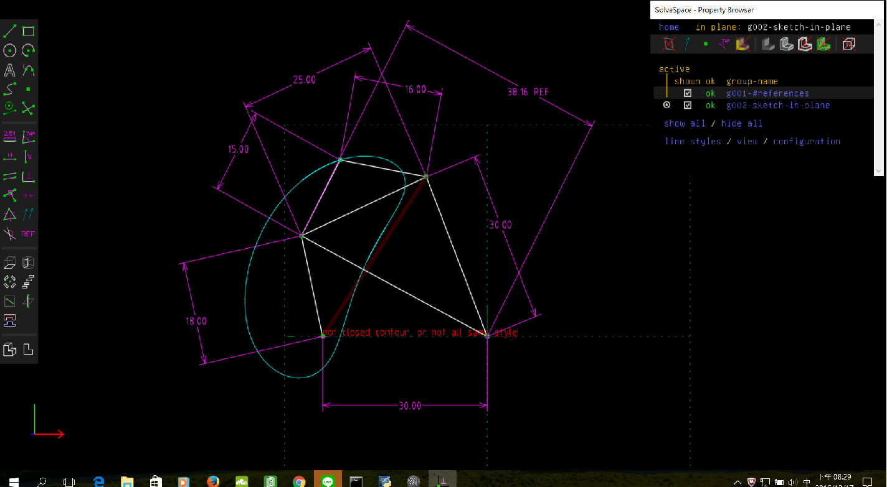

Title: 第十週
Date: 2016-11-18 22:00
Category: Misc
Tags: Solvespace
Author: 40423247

Solvespace

<!-- PELICAN_END_SUMMARY -->

有關 Solvespace 機構模擬功能介紹, 與 Python3 及 Brython 程式驗證

路徑圖

將所得到的點座標 .csv 以 Excel 畫圖。路徑圖

心得

來到了第10週，每次上這門課都覺得英文真的很重要，很多國外網站還有城市都是用英文。

信裡面這麼說The page build failed with the following error:

The tag `notebook` on line 13 in `plugin/liquid_tags/test_data/content/test-ipython-notebook-nbformat3.md` is not a recognized Liquid tag. For more information, see https://help.github.com/articles/page-build-failed-unknown-tag-error.

For information on troubleshooting Jekyll see:

https://help.github.com/articles/troubleshooting-jekyll-builds

If you have any questions you can contact us by replying to this email.

我看不太懂他說什麼，不過我們經過討論才知道只要把test_data刪掉，就可解決。我覺得現在GitHub越來越多問題了。

