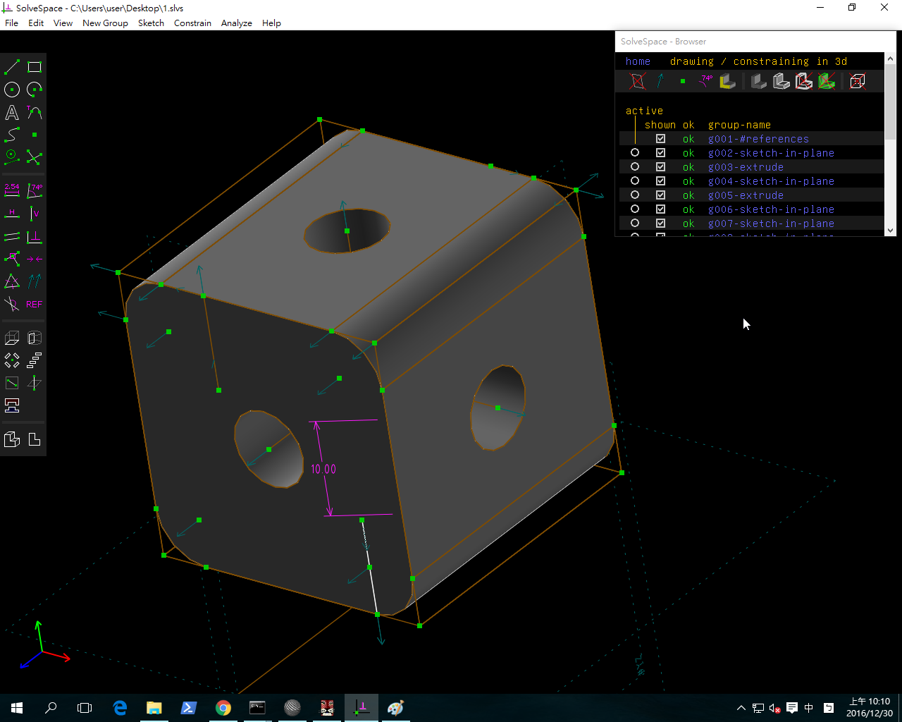
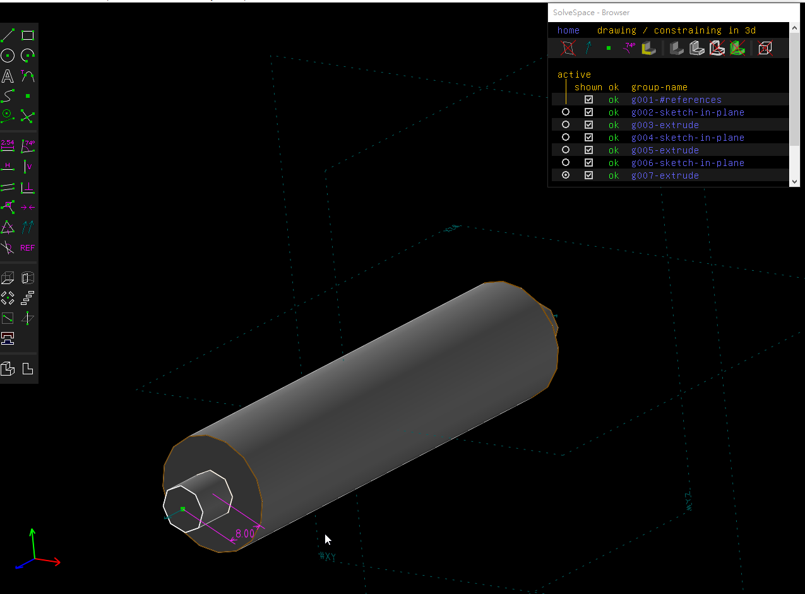
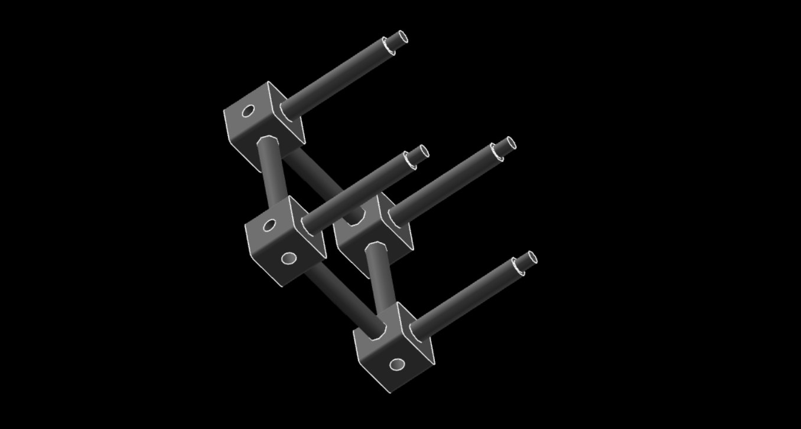

Title: 第十二週
Date: 2016-12-02 22:00
Category: Misc
Tags: Solvespace(2)
Author: 40423247

Solvespace

<!-- PELICAN_END_SUMMARY -->

利用SOLVESPACE練習繪製COLLEGE_STUDENT_PRIMER_CREO_2.PDF裡的零件並學習如何組立。

<iframe src="https://player.vimeo.com/video/198585341" width="640" height="480" frameborder="0" webkitallowfullscreen mozallowfullscreen allowfullscreen></iframe>

<iframe src="https://player.vimeo.com/video/198952150" width="640" height="480" frameborder="0" webkitallowfullscreen mozallowfullscreen allowfullscreen></iframe>

心得

今天第十二次上課，要畫第二張圖，慢慢熟悉SOLVESPACE了，雖然還是會有很多地方卡住。不過我還是畫好了，真開心。

