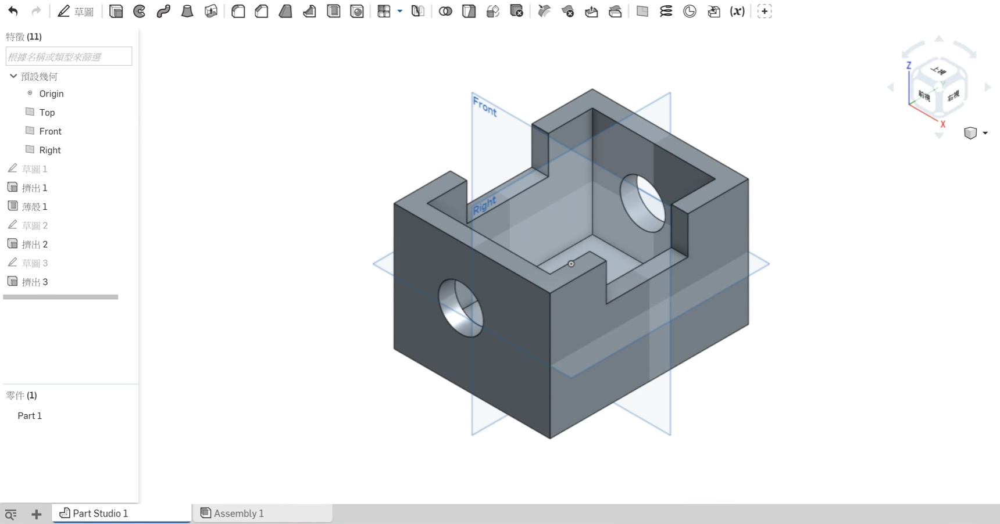

Title: 第十三週
Date: 2016-12-09 22:00
Category: Misc
Tags: OnShape(1)
Author: 40423247

上課內容

<!-- PELICAN_END_SUMMARY -->

利用OnShape練習繪製零件。

心得

今天第十三次上課，又有交一個新的畫圖軟體OnShape，老師說是Solidworks/的工程師寫的，應該不會太難，只需要熟悉一下。

