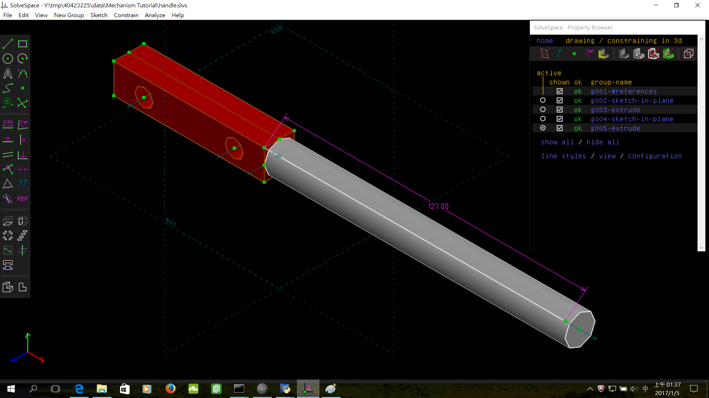

Title: 第十六週
Date: 2016-12-30 22:00
Category: Misc
Tags: OnShape(2)
Author: 40423247

OnShape繪製

<!-- PELICAN_END_SUMMARY -->

OnShape繪製Mechanism Tutorial

<iframe src="./../data/image/W16-1.html" width="800"  height="800"/></iframe>

零件

<iframe src="./../data/image/W16-2.html" width="800"  height="800"/></iframe>

<iframe src="./../data/image/W16-3.html" width="800"  height="800"/></iframe>

<iframe src="./../data/image/W16-4.html" width="800"  height="800"/></iframe>

<iframe src="./../data/image/W16-5.html" width="800"  height="800"/></iframe>

<iframe src="./../data/image/W16-6.html" width="800"  height="800"/></iframe>

<iframe src="./../data/image/W16-7.html" width="800"  height="800"/></iframe>

<iframe src="./../data/image/W16-8.html" width="800"  height="800"/></iframe>

<iframe src="./../data/image/W16-9.html" width="800"  height="800"/></iframe>

心得

今天12月30號上課，因為比較習慣用SolveSpace，所以用這種軟體畫，但看到很多人都去跨年了，好難過。

